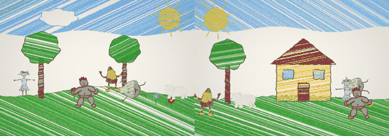
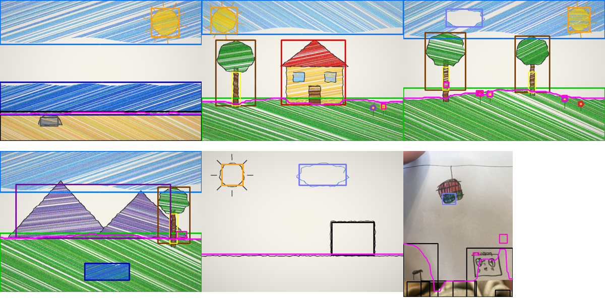
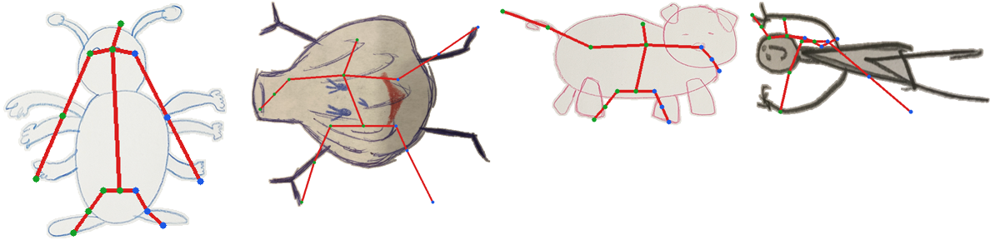

# Animated Drawings World

A Unity game where children's drawings come alive inside a child's drawing. Load (or swap) a
drawn background and it is analyzed for the things in it — sky, grass, water, trees, sun,
clouds, houses, flowers, rocks, mountains and where the ground is. Load drawn characters and they
are rigged with the approach from Meta's
[AnimatedDrawings](https://github.com/facebookresearch/AnimatedDrawings), animated with Meta's
motion capture clips, and they live in the scene: they climb the trees, sleep on the grass, smell
the flowers, swim in the lake, hide in the house, and meet each other to chat, dance, high-five,
scare and chase.



## Play

1. Open the project in Unity 6 (6000.6) and press Play. `Assets/Scenes/GameScene.unity` is the
   game scene (**AnimatedDrawingsWorld → Build Game Scene** recreates it), but pressing Play in any
   scene starts the game. Errors, if any, appear in the toolbar and the log at the bottom.
2. The toolbar:
   * **Background...** — pick a sample, open any PNG/JPG file, or paste a web address. Swapping
     the background re-analyzes it and moves everyone onto the new ground.
   * **Add character...** — samples, or any photo/scan of a drawing (file or URL). **New is:**
     chooses Human / Monster / Animal (Auto guesses from the silhouette).
   * **Show analysis** — overlays every detected object with its confidence and the walkable
     ground band.
   * Pause and simulation speed.
3. Click a character to see what it is thinking and its needs, give it orders (Climb, Sleep, Swim,
   Smell, Hide, Dance, Scare…), change its kind, or remove it. **Drag** a character to pick it up:
   drop it in a tree crown and it sits on a branch then climbs down, drop it in the sky and it
   falls. **Right-click** the ground to send the selected character there.

In the Editor the file buttons use the native file dialog; player builds have an in-game browser.

## How it works

```
background image ──► BackgroundAnalyzer ──► SceneLayout (objects + walkable ground profile)
                                                   │
character drawing ─► Meta TorchServe models ─┐     ▼
                  └► built-in cut-out +      ├► CharacterAnnotation ─► DrawingRig + SkinnedDrawingMesh
                     skeleton estimator ─────┘   (texture, mask, char_cfg.yaml)        │
                                                                                        ▼
Meta BVH motions ─► Meta's Retargeter (offline bake) ─► MotionClip ──► CharacterAnimator ─► CharacterView
procedural poses (climb, sit, sleep, swim, smell…) ────────────────────┘        ▲
                                                                                 │
                                             GameWorld: needs, object affordances, social life
```

* **Scene analysis** (`Assets/Scripts/Logic/Scene`). Lighting is flattened (photos of paper
  have shadows), pixels are classified into crayon colour families, crayon texture is smoothed
  (paper shows through strokes), and connected regions are turned into objects by colour, shape
  and position: blue along the top is sky; green/brown/yellow along the bottom is grass/dirt/sand;
  a brown vertical trunk under a green blob is a tree (a green blob in the air is a lollipop tree);
  a round yellow blob up high is the sun; a filled rectangle on the ground with a roof is a house;
  small bright blobs on the ground are flowers; pointy shapes on the horizon are mountains.
  Pencil-only drawings are handled through closed outlines (sun, clouds, boxes) and the horizon
  line. The ground profile says where characters can stand, and how deep the ground band is.
* **Characters** (`Assets/Scripts/Logic/Characters`, `Runtime/MetaTorchServeClient.cs`). If Meta's
  TorchServe container is running, the game sends the drawing to Meta's
  `drawn_humanoid_detector` and `drawn_humanoid_pose_estimator` exactly like Meta's
  `image_to_annotations.py`. Otherwise (or for monsters Meta's humanoid models reject) a C# port of
  Meta's `segment()` cuts the drawing out of the paper and a silhouette-based estimator finds the
  same 16-joint skeleton. Either way the result is a Meta-format annotation, and Meta annotation
  folders (texture.png, mask.png, char_cfg.yaml — including custom skeletons such as Meta's
  six-armed bug) load directly.
* **Animation** (`Assets/Scripts/Logic/Animation`). `DrawingRig` is a port of Meta's
  `AnimatedDrawingRig.set_global_orientations`; the mesh follows Meta's bone-to-triangle
  assignment (closest bone *through* the drawing) and its depth-sorted body-part drawing, with
  linear-blend skinning instead of ARAP so dozens of characters can deform on the CPU every frame.
  Meta's BVH clips (walk = zombie, wave_hello, jumping, jumping_jacks, jesse_dance, dab) are
  retargeted by **Meta's own `Retargeter`** once, offline, with `Tools/MotionBaker` — the result is
  character-independent — and stored in `StreamingAssets/AnimatedDrawings/Motions`. Activities
  Meta has no capture for (climbing, sitting, lying asleep, swimming, smelling, hiding, yawning)
  are procedural poses on the same rig.
* **Behaviour** (`Assets/Scripts/Logic/Behavior/GameWorld.cs`). Each character has energy,
  sociability and curiosity; it picks what to do from what the scene affords (tree → climb or sit
  in the shade, grass → nap, flower → smell, water → swim, house/bush → hide, rock → sit on it,
  sun → wave/dance, cloud → jump for it) and from who is around (people chat, then dance / high-five
  / wave goodbye; monsters roar and people flee — sometimes chased; monsters throw dance parties;
  people pet animals; sleepers get woken up). Humans passing a monster get a fright.
* **Unity layer** (`Assets/Scripts/Runtime`): `GameController`, `CharacterView` (mesh rebuilt each
  frame from the posed rig), `BackgroundView`, `GameUI` (IMGUI), `RuntimeFileBrowser`.

Everything in `Assets/Scripts/Logic` is plain C# with no UnityEngine dependency, so it runs (and
is tested) outside Unity.

## Tests

```
dotnet test Tests/LogicTests                                          # 64 tests, ~35 s
dotnet build Tests/UnityCompileCheck/UnityCompileCheck.csproj         # Unity runtime scripts compile
dotnet build Tests/UnityCompileCheck/EditorCheck/EditorCheck.csproj   # Editor scripts compile
RENDER_SIM=1 dotnet test Tests/LogicTests --filter CharactersLive     # + frames in Tests/Output/sim
```

Test images (`Tests/TestImages`, see its README): real children's drawings from Meta's
repository — a boy, a ballerina, a stick figure, a candy-corn monster, a six-armed bug, a pig, a
garlic monster photo and a kid's drawing of a room — with Meta's own masks and skeletons as ground
truth, plus crayon-style landscapes with known object positions.

| check | result |
|---|---|
| cut-out vs Meta's segmentation (6 drawings) | IoU 0.986 – 1.000 |
| drawing found on a photographed page vs Meta's detector | IoU 0.78 (pig), 0.89 (bug) |
| built-in skeleton vs Meta's pose model (people/humanoids) | mean joint error 4.8 – 6.3 % of height |
| scene objects found (5 scenes, 32 objects) | recall 30 / 32, precision 20 / 22 detections |
| simulation: 4 minutes × 6 backgrounds × 5 characters | nobody floats/sinks; trees climbed, flowers smelled, lakes swum, houses entered, characters interact |




## Meta's pipeline

`META_ANIMATED_DRAWINGS_INTEGRATION.md` explains the TorchServe setup. With the container running
the game uses Meta's models automatically (`GameController → Use Meta TorchServe`).

## Limitations

* The scene analyzer is heuristic: it expects the usual conventions of children's drawings (colour
  coding, ground at the bottom). Unusual palettes or very busy photos can be misread; the overlay
  shows what was understood.
* Without Meta's models, the skeleton of unusual creatures is a guess; the Human/Monster/Animal
  kind guess is only a default.
* The Unity layer was compile-checked against Unity reference assemblies and the whole game logic
  is tested headlessly, but the scene has not been run inside the Unity Editor as part of this
  change.
